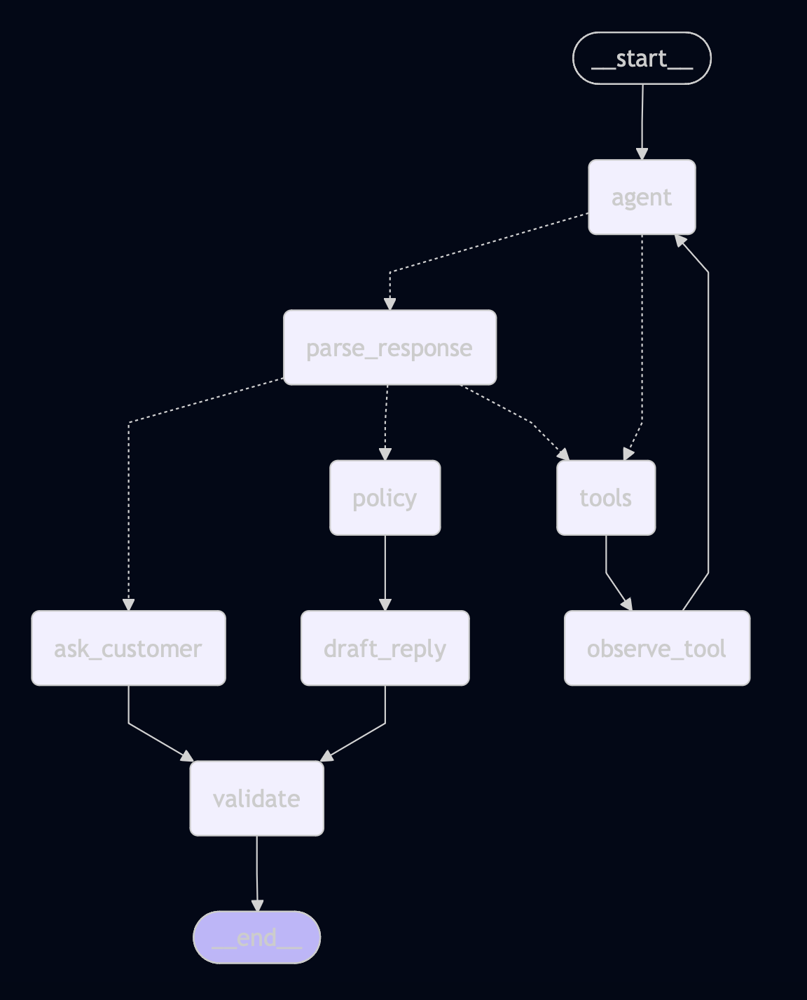

# Autonomous Returns & Resolution Agent

This is a small AI agent prototype for handling return and order-resolution
tickets.

The agent talks to the customer, asks for missing information when needed, looks
up mock order data through a tool, applies a deterministic return policy, and
then returns a strict JSON decision.

The main idea is simple: let the LLM handle the conversation, but do not let it
make the business policy decision by itself.

Final output always looks like this:

```json
{
  "order_id": "101",
  "decision": "ESCALATE",
  "customer_reply": "Customer-facing reply goes here.",
  "category": "Change of mind"
}
```

## How To Run

Clone the repo:

```bash
git clone <repo-url>
cd my-returns-agent
```

Install `uv` first if you do not have it:

```bash
curl -LsSf https://astral.sh/uv/install.sh | sh
```

Install dependencies:

```bash
uv sync
```

Create the environment file:

```bash
cp .env.example .env
```

Add your Anthropic key in `.env`:

```bash
ANTHROPIC_API_KEY=your_key_here
ANTHROPIC_MODEL=claude-haiku-4-5-20251001
```

Run one ticket from the CLI:

```bash
uv run returns-agent \
  --message "Where is my outdoor dining set? Order 103." \
  --pretty
```

Run interactive mode:

```bash
uv run returns-agent --pretty
```

Run the Streamlit demo:

```bash
uv run --group demo streamlit run streamlit_app.py
```

Run tests:

```bash
uv run ruff check src tests streamlit_app.py
uv run pytest
```

The default tests do not call the live LLM. They use deterministic test models
so anyone can run the suite without an API key, quota, or network dependency.

Run the optional live LLM smoke and golden tests:

```bash
RUN_LIVE_LLM_TESTS=true uv run pytest tests/test_live_agent.py
```

Print the LangGraph diagram:

```bash
uv run returns-agent --show-graph
```

## Sample Output

```json
{
  "order_id": "103",
  "decision": "REJECT",
  "customer_reply": "Thanks for reaching out about order 103. Your Outdoor Dining Set is currently in transit, so please wait until delivery before starting a return.",
  "category": "Delivery status enquiry"
}
```

## What The Agent Does

The flow is:

1. Customer sends a message.
2. Agent reads the conversation and decides what is missing.
3. If it has an order number, it calls the `get_order` tool.
4. Once trusted order data exists, the graph runs the policy node.
5. The final answer is validated as strict JSON.

The LLM is used for the language part: understanding the message, asking
follow-up questions, and writing a customer-friendly reply.

The policy decision is not left to the LLM. Refund, reject, and escalate are
decided by normal Python code.

## Current Mock Orders

| Order | Item | Price | Status |
| --- | --- | ---: | --- |
| `101` | Milan Boucle Sofa | `$899` | Delivered 5 days ago |
| `102` | Ceramic Vase | `$45` | Delivered 45 days ago |
| `103` | Outdoor Dining Set | `$1200` | In Transit |

## Policy Rules

- customers can return items within 30 days of delivery
- items over `$500` go to human review
- in-transit orders cannot be returned until delivery

So the agent can talk naturally, but the business decision stays predictable.

## LangGraph Loop

This is the rough graph:

```text
START
  -> agent
  -> tools, if get_order is needed
  -> observe_tool
  -> agent
  -> parse_response
  -> ask_customer, if more info is needed
  -> policy, if trusted order data exists
  -> draft_reply
  -> validate
  -> END
```



I built the graph this way because I did not want the LLM to behave like a
normal chatbot that decides everything by itself. The agent can understand the
customer message, ask follow-up questions, and call the order lookup tool, but
the actual return decision goes through a normal Python policy node.

The `agent -> tools -> observe_tool -> agent` loop is where the agent gets
trusted order data and then reasons again with that data. If something is
missing, the graph returns `ASK_FOR_INFO` as strict JSON and waits for the next
customer message. When the customer replies, the app passes the previous state
back in, so the conversation history is not lost.

The final `validate` node is there because every path, even asking a follow-up
question, should still produce the four-field JSON payload required by the task.

## LangSmith

LangSmith tracing is optional. If you want it, add this to `.env`:

```bash
LANGSMITH_TRACING=true
LANGSMITH_API_KEY=your_langsmith_key_here
LANGSMITH_PROJECT=returns-agent-assessment
```

You can also print a small local trace:

```bash
uv run returns-agent \
  --message "Where is my outdoor dining set? Order 103." \
  --pretty \
  --show-trace
```

## Tests

The tests cover:

- the four assessment scenarios
- `ASK_FOR_INFO` and resume behavior
- policy rules
- the mocked order lookup tool
- invalid order handling
- order-number-only messages that still need issue context
- LangGraph diagram rendering
- strict JSON output
- a small JSONL golden set for evaluation-style testing
- optional live LLM smoke and golden tests, skipped unless `RUN_LIVE_LLM_TESTS=true`

The normal suite should show `16 passed, 3 skipped`. The skipped tests are the
live LLM tests.

The golden cases are in:

```text
tests/golden_cases.jsonl
```

I keep the golden cases separate from the model. By default they run with a
deterministic test model for repeatability. When I want to check the real model
path, I run the same style of cases through the optional live tests and inspect
the traces.

## Important Files

- `src/returns_agent/models.py` - Pydantic models and the final JSON contract.
- `src/returns_agent/state.py` - LangGraph state for messages, order data, policy result, and final decision.
- `src/returns_agent/prompts.py` - system prompt, tool rules, policy rules, and prompt-injection rules.
- `src/returns_agent/tools.py` - mock order lookup wrapped as a LangChain tool.
- `src/returns_agent/policy.py` - deterministic refund/reject/escalate logic.
- `src/returns_agent/llm.py` - Anthropic model setup.
- `src/returns_agent/graph.py` - LangGraph wiring.
- `src/returns_agent/nodes.py` - the actual node functions used by the graph.
- `src/returns_agent/main.py` - CLI entry point.
- `src/returns_agent/trace.py` - small Markdown trace helper.
- `streamlit_app.py` - simple chat UI for testing the agent.
- `tests/golden_cases.jsonl` - golden conversation cases.
- `tests/test_golden.py` - runs the golden cases.
- `tests/test_agent.py` - assessment, resume, graph, and edge-case tests.
- `tests/test_policy.py` - policy tests.
- `tests/test_tools.py` - tool tests.
- `tests/test_live_agent.py` - optional live LLM smoke and golden tests.
- `tests/deterministic_llm.py` - small model doubles used by the default tests.

## If This Was Production

I would keep the same shape, but replace the mock order data with a real order
API, persist state by ticket ID, add proper customer identity checks, and connect
human-review cases to the customer care workflow.
